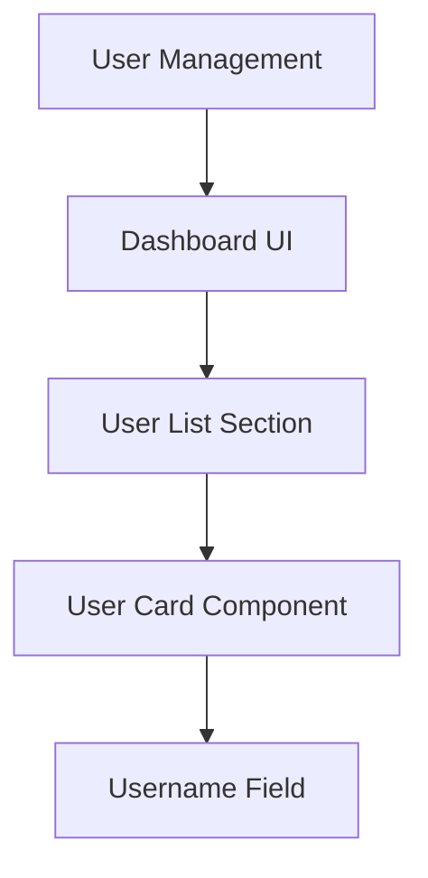

# The `.compospec/` Standard

**AI-readable specification format for structured product development**

---

## Overview

`.compospec/` is a directory standard for storing product specifications in a format that both humans and AI tools can understand. Like `.github/` for CI/CD workflows or `.vscode/` for editor configuration, `.compospec/` provides a standardized location for spec files in your repository.

---

## Why This Standard Exists

### The Problem with Traditional Specs

Typical documentation structure:

```
/docs
├─ README.md              (overview)
├─ ARCHITECTURE.md        (system design)
├─ API_SPEC.md            (endpoints)
├─ USER_FLOWS.md          (user journeys)
└─ COMPONENTS.md          (UI components)
```

**Issues:**
- ❌ Disconnected files with no relationships
- ❌ Manual flow diagrams that get outdated
- ❌ No semantic structure (just prose)
- ❌ AI tools can't understand product hierarchy
- ❌ Updates require manual sync across multiple files

### The Compospec Solution

```
.compospec/
└─ spec.md    (6-level hierarchy + auto-generated flow)
```

**Benefits:**
- ✅ Single source of truth
- ✅ Structured 6-level hierarchy (Product → Module → UI → Section → Component → Element)
- ✅ Auto-generated flow diagrams (always up-to-date)
- ✅ Explicit card relationships
- ✅ AI-readable format
- ✅ Export from visual builder (not hand-written)

---

## The 6-Level Hierarchy

Every Compospec export follows this semantic structure:

```
🟣 Product (Top-level: entire product)
└─ 🟣 Module (Feature group)
   └─ 🟪 UI (User interface)
      └─ 🟪 Section (UI subdivision)
         └─ 🟣 Component (Reusable element)
            └─ 🟣 Element (Atomic part)
```

**Example: Medical Platform**

```
🟣 Livemedy (Product)
└─ 🟣 User Management (Module)
   └─ 🟪 My Page (UI)
      └─ 🟪 Personal Information (Section)
         └─ 🟣 Medical Background Card (Component)
            └─ 🟣 Chronic Diseases List (Element)
```

This hierarchy is preserved in the exported markdown, making it machine-readable.

---

## Directory Structure

### Minimal Setup (Recommended)

```
.compospec/
└─ spec.md    # Full spec with 6-level hierarchy + flow
```

### Advanced Setup (Optional)

```
.compospec/
├─ spec.md          # Full specification
├─ flow.md          # Standalone flow diagram (Mermaid syntax)
└─ spec.pdf         # Stakeholder-friendly version
---

## Export Format

### Markdown Structure

Exported `.compospec/spec.md` contains:

1. **Project metadata** (title, description, version)
2. **6-level card hierarchy** (structured sections)
3. **Auto-generated flow diagram** (Mermaid syntax)
4. **Card relationships** (parent/child links)

**Example excerpt:**
````markdown
# AI Content Moderation Platform

## Product Overview
Automated content moderation system for social media platforms...

---

## Module: User Management
### UI: Dashboard
#### Section: User List
##### Component: User Card
###### Element: Username Field

**Type:** Text Input
**Validation:** Required, 3-50 characters
**Error State:** "Username must be between 3-50 characters"

---

## Flow Diagram


````

---

## How AI Tools Read It

### File-Based Workflow

**Step 1: Export from Compospec**
````bash
# In Compospec app:
Export → Markdown → Download spec.md
````

**Step 2: Add to repository**
````bash
mkdir -p .compospec
mv ~/Downloads/spec.md .compospec/
git add .compospec/spec.md
git commit -m "Add product specification"
git push
````

**Step 3: AI tool reads it**

**Claude Desktop:**

"Read .compospec/spec.md and create the User Management module"

**Cursor:**

@.compospec/spec.md create the dashboard UI based on the spec

**Windsurf:**

/read .compospec/spec.md
/implement login-flow

---

### Link-Based Workflow (Live)

**Step 1: Create public link in Compospec**

Share → Public Link → Copy
https://app.compospec.com/shared/91ca49ea-a1e1-4e43-abd2-f1ae42049f21

**Step 2: Give URL to AI tool**

**Claude Desktop:**

"Read this Compospec spec and implement the user dashboard:
https://app.compospec.com/shared/91ca49ea-a1e1-4e43-abd2-f1ae42049f21"

**Cursor:**

@web https://app.compospec.com/shared/91ca49ea-a1e1-4e43-abd2-f1ae42049f21
Now create the login screen

**Benefits:**
- ✅ No export needed
- ✅ Always reads latest version
- ✅ Update spec → AI sees changes immediately
- ✅ No manual sync

---

## Real-World Example

### AI Content Moderation Platform

**Live spec:** https://app.compospec.com/shared/91ca49ea-a1e1-4e43-abd2-f1ae42049f21

**Structure:**
- 6 modules
- 86 cards total
- Full flow diagram
- Complete component hierarchy

**Export size:** ~15KB markdown file

**AI reads:**
- ✅ All 6 modules
- ✅ Card relationships
- ✅ Flow diagram
- ✅ Component details
- ✅ Validation rules

---

## Best Practices

### ✅ Do

- **Keep spec.md in root `.compospec/` directory**
- **Commit after every major spec update**
- **Use public links for live collaboration**
- **Export to PDF for non-technical stakeholders**
- **Reference `.compospec/spec.md` in your main README**

### ❌ Don't

- **Don't manually edit exported spec.md** (re-export from Compospec instead)
- **Don't version individual cards separately** (keep as single file)
- **Don't duplicate content in other docs** (link to `.compospec/` as source of truth)

---

## Integration Examples

### With Claude Code (Future: MCP)

````bash
# Future workflow (when MCP integration launches):
claude connect compospec

# Claude Code:
✅ Connected to your Compospec account
✅ Real-time sync enabled
✅ No manual export needed
````

### With GitHub Actions (Future)

````yaml
# .github/workflows/sync-spec.yml
name: Sync Compospec
on:
  push:
    paths:
      - '.compospec/**'
jobs:
  validate:
    runs-on: ubuntu-latest
    steps:
      - uses: compospec/validate-action@v1
````

---

## FAQ

**Q: Do I need an API to use this?**  
A: No. Export to markdown or use public links. That's it.

**Q: Can AI tools read the flow diagram?**  
A: Yes. The Mermaid syntax is in the markdown file.

**Q: What if I update my spec in Compospec?**  
A: Re-export to `.compospec/spec.md` (file-based) or just update — public link stays current (link-based).

**Q: Is this compatible with OpenSpec or other versioning tools?**  
A: Yes. `.compospec/` is semantic/structural versioning. OpenSpec adds temporal versioning on top.

**Q: Do I need Compospec to create `.compospec/` files?**  
A: Compospec exports valid `.compospec/spec.md` files. You *could* hand-write them, but the visual builder ensures consistency and auto-generates flows.

---

## Roadmap

**Available Now:**
- ✅ Markdown export
- ✅ PDF export
- ✅ Public link sharing
- ✅ 6-level hierarchy
- ✅ Auto-flow diagrams

**Coming Soon:**
- 🔄 **MCP Integration** (Q2 2026) - Real-time sync with AI tools
- 🔄 **GitHub Action** - Auto-validate on commit
- 🔄 **CLI Tool** - `compospec export`, `compospec validate`

---

## Get Started

1. **Build your spec** → [app.compospec.com](https://app.compospec.com)
2. **Export to markdown** → Download `spec.md`
3. **Add to repo** → `mkdir .compospec && mv spec.md .compospec/`
4. **Use with AI tools** → Reference in prompts

**Or try a live example:**
- [AI Content Moderation Platform](https://app.compospec.com/shared/91ca49ea-a1e1-4e43-abd2-f1ae42049f21)

---

**Stop writing specs. Start building them.**
