# The Compospec Methodology: Deep Dive

**How structured context blocks enable specification intelligence**

---


---

## Table of Contents

1. [The Structural Foundation](#1-the-structural-foundation)
2. [The Workflow](#2-the-workflow)
3. [AI-Ready Architecture](#3-ai-ready-architecture)
4. [Implementation: Compospec Platform](#4-implementation-compospec-platform)
5. [Comparison to Other Approaches](#5-comparison-to-other-approaches)

---

## 1. The Structural Foundation

### 1.1 Why Hierarchy?

UI components nest. Code modules nest. API endpoints nest. Requirements should too.

**The 6-Level System:**
```
📦 Product
  └─ 📂 Module
      └─ 🖥️ User Interface
          └─ 📐 Section
              └─ 🧩 Component
                  └─ ⚛️ Element
```

**Why this maps to development:**

| Level | Frontend Analog | Backend Analog | Architecture Analog |
|-------|----------------|----------------|---------------------|
| **Product** | Application root | Service mesh | System architecture |
| **Module** | Feature slice | Microservice | Bounded context |
| **User Interface** | Page/Route | API endpoint | Interface contract |
| **Section** | Layout region | Controller | Business logic layer |
| **Component** | React component | Method/Function | Domain object |
| **Element** | HTML element | Parameter | Data field |
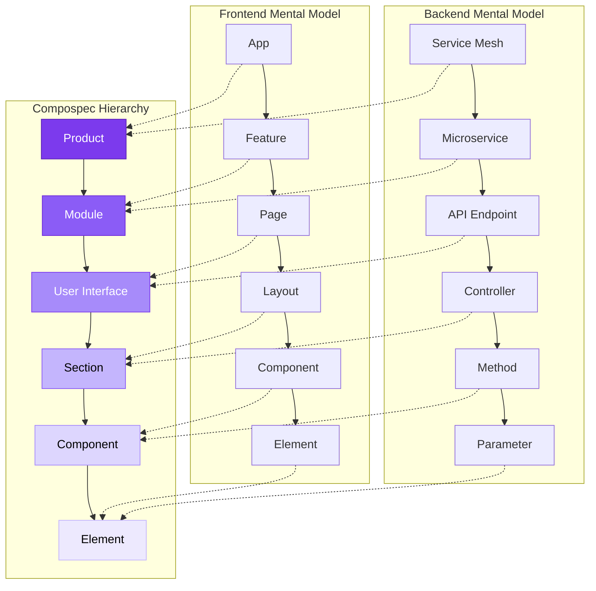

### 1.2 The Parent-Child Link

Every card (except Product) has **exactly one parent**. This single constraint creates:

#### 1. Dependency Graph
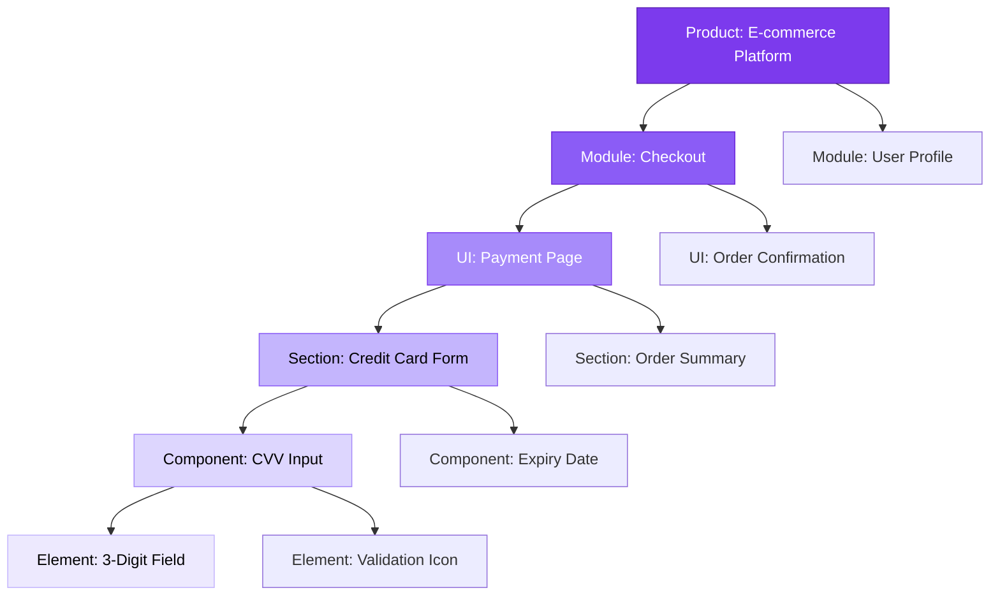

**Queryable relationships:**
- What depends on this card? (children)
- What does this card depend on? (ancestors)
- What's the full context path? (root to current)

#### 2. Context Inheritance

Child cards inherit constraints from parent chain:
```
Product: Mobile Banking App
  → Security: 2FA required
  → Compliance: GDPR, PCI-DSS
  
  Module: Money Transfer
    → Inherits: 2FA, GDPR, PCI-DSS
    → Adds: Transaction limits, anti-fraud checks
    
    UI: Transfer Dashboard
      → Inherits: All above
      → Adds: Accessibility AA standard
      
      Component: Amount Input
        → Inherits: All above
        → Implements: Masked input, decimal validation
```

When AI generates code for "Amount Input", it has the full context chain — not just the component spec.

#### 3. Traceability


"Why does this button exist?" → Follow parent chain to Product-level business goal.

---

## 2. The Workflow

### 2.1 Card Creation
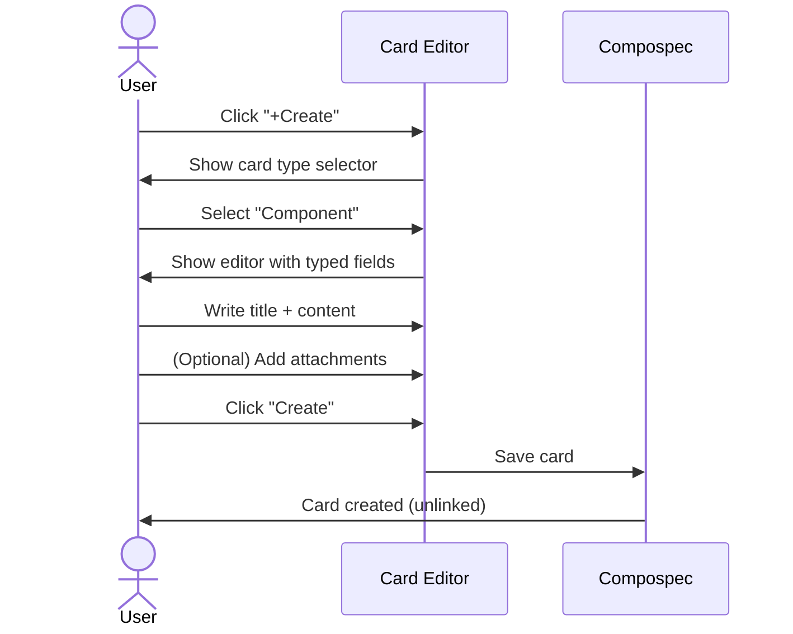

**Key insight:** Cards start **unlinked**. Linking is explicit, not automatic.

### 2.2 Linking Strategy
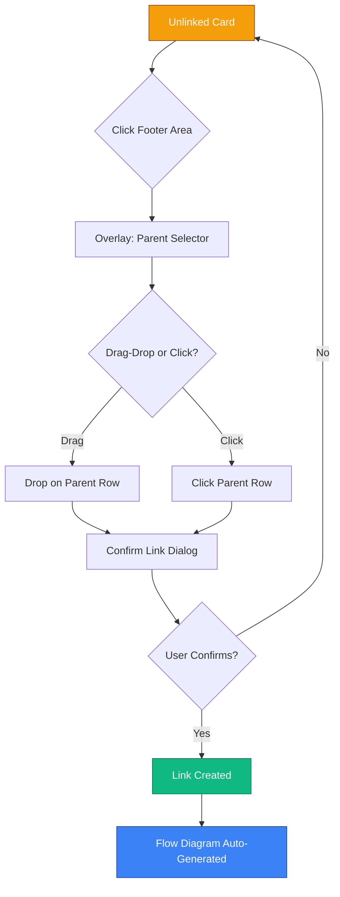

**Why explicit linking matters:**

- **Prevents orphan cards:** System flags unlinked cards
- **Flexible hierarchy:** Child cards can link to any parent level (Element → Product is valid)
- **Single parent rule:** Each card has exactly one parent, preventing ambiguity
- **Maintains graph integrity:** No circular dependencies

### 2.3 Flow Diagram Generation

When a link is created:


**Flow diagram = visual rendering of card relationships**

Not a separate artifact. Not manually drawn. Derived from data.

---

## 3. AI-Ready Architecture

### 3.1 Structured Context Blocks

Traditional spec:
```
"The login page should have a username field, password field, 
and a submit button. The username must be an email. 
Password should be masked. Show error if fields are empty."
```

Compospec equivalent:
```yaml
Card Type: User Interface
Title: Login Page
Parent: Authentication Module

Card Type: Component
Title: Username Input
Parent: Login Page
Constraints:
  - Type: email
  - Validation: required

Card Type: Component
Title: Password Input
Parent: Login Page
Constraints:
  - Display: masked
  - Validation: required

Card Type: Component
Title: Submit Button
Parent: Login Page
Behavior:
  - on_click: validate_and_submit
  - on_error: show_inline_error
```

**Why this matters for AI:**

| Traditional Spec | Compospec Card |
|-----------------|----------------|
| Unstructured prose | Typed fields |
| Implicit relationships | Explicit parent-child |
| Context scattered | Context inherited via chain |
| One-time snapshot | Version-controlled, persistent |

### 3.2 The "Prompt Debt" Problem
```mermaid
graph TB
    subgraph "Traditional Workflow"
    T1[BA writes 74-page Word doc] --> T2[Developer reads page 23]
    T2 --> T3[Developer asks AI to generate code]
    T3 --> T4[AI has no context from pages 1-22, 24-74]
    T4 --> T5[Hallucinated output]
    end
    
    subgraph "Compospec Workflow"
    C1[BA creates hierarchical cards] --> C2[Developer selects card]
    C2 --> C3[System provides card + parent chain]
    C3 --> C4[AI receives full structured context]
    C4 --> C5[Accurate output]
    end
    
    style T5 fill:#ef4444,stroke:#991b1b,color:#fff
    style C5 fill:#10b981,stroke:#047857,color:#fff
```

**Compospec eliminates prompt debt by:**

1. **Atomic context units:** Each card = one semantic scope
2. **Explicit dependencies:** Parent chain = complete context
3. **Persistent structure:** Cards update, context stays linked

### 3.3 Future: Cards as AI Prompts

*(Roadmap: Q2 2026)*
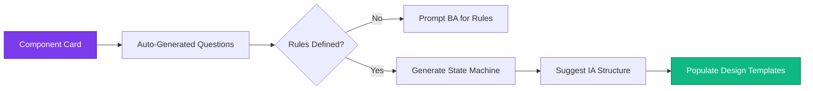

Each card becomes a **queryable semantic unit** that AI agents can:

- Ask clarifying questions (BPMN-style rule extraction)
- Suggest information architecture
- Generate UI mockups from templates
- Validate implementation against spec

---

## 4. Implementation: Compospec Platform

### 4.1 Dashboard
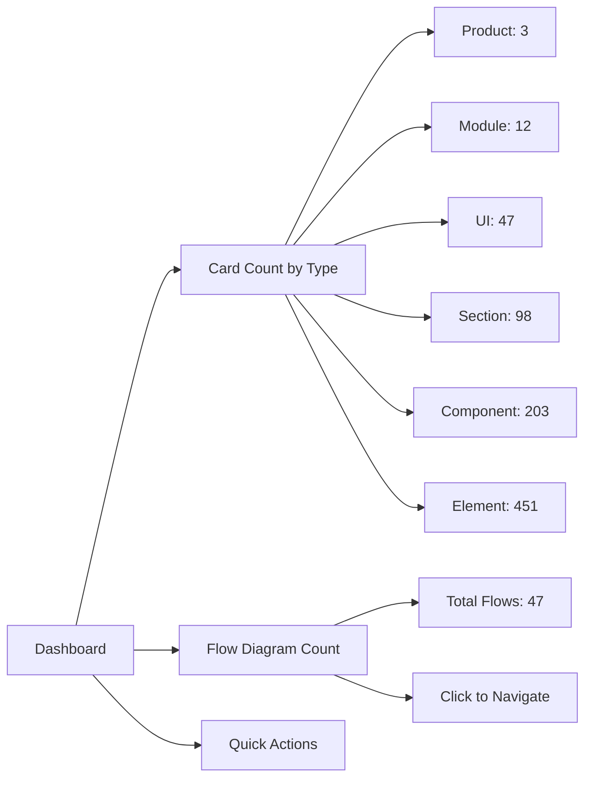

### 4.2 Card Management

**Filters:**

- **Group:** Linked cards in tree view
- **Date:** Cards created in date range
- **Type:** Stack view by card type
- **Unlinked:** Orphan cards flagged
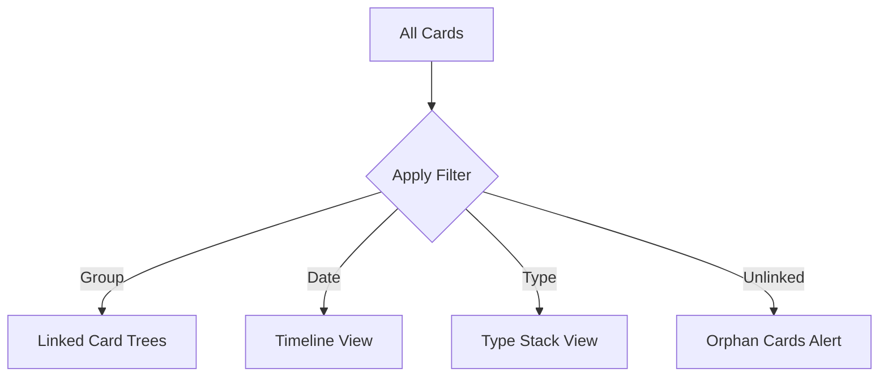

**Actions:**

- View card content
- Edit card
- Export as .md or .pdf
- Share link (public or private)
- Navigate to flow diagram

### 4.3 Flow Management
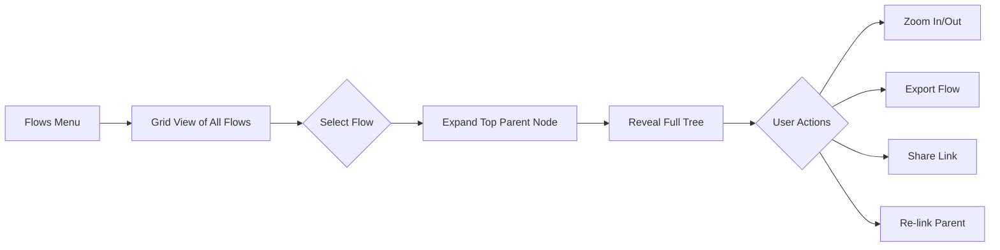

### 4.4 Templates

*(Coming Q1 2026)*

Industry-specific starter packs:

- **Fintech:** Payment flows, KYC, transaction histories
- **CRM:** Contact management, pipeline views, reporting
- **E-commerce:** Product catalog, cart, checkout, order tracking

Import templates → customize → link to your product structure.

### 4.5 Screenshot Annotation

*(Coming Q1 2026)*
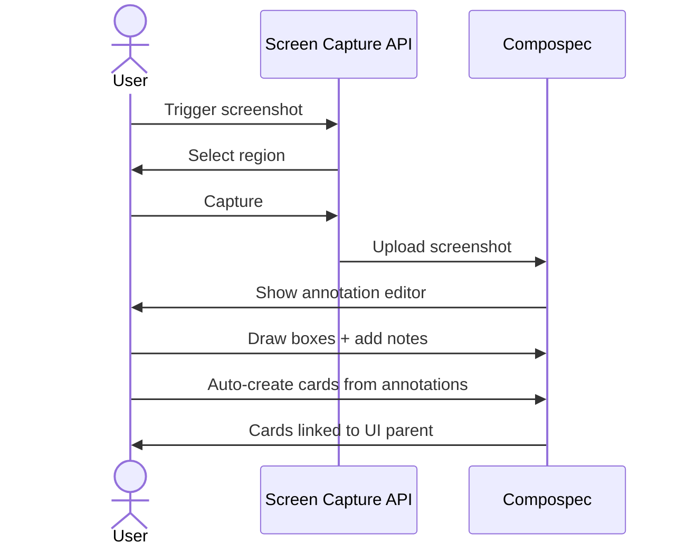

Turn legacy UI screenshots into structured specs. No manual typing.

### 4.6 MCP Integration

*(Coming Q1 2026)*
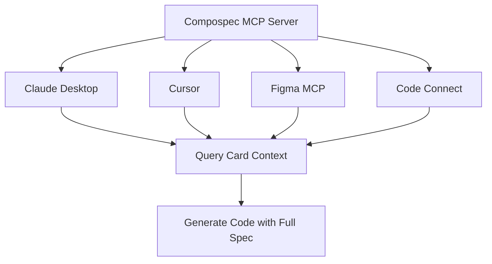

Direct protocol integration → AI tools query Compospec cards in real-time.

---

## 5. Comparison to Other Approaches

| Approach | Structure | AI-Ready | Developer-Friendly | Human-First | Auto-Flows |
|----------|-----------|----------|-------------------|-------------|-----------|
| **Word/Confluence** | ❌ Prose | ❌ No | ❌ No | ✅ Yes | ❌ No |
| **Notion/Linear** | ⚠️ Flat | ⚠️ Partial | ⚠️ Partial | ✅ Yes | ❌ No |
| **GitHub SpecKit** | ✅ YAML | ✅ Yes | ⚠️ Code-first | ❌ No | ❌ No |
| **AWS Kiro** | ✅ Structured | ✅ Yes | ⚠️ AWS-locked | ❌ No | ⚠️ Manual |
| **Figma/FigJam** | ❌ Canvas | ❌ No | ❌ No | ✅ Yes | ❌ No |
| **Compospec** | ✅ Hierarchy | ✅ Yes | ✅ Yes | ✅ Yes | ✅ Auto |

### Why Compospec Wins

**vs Word/Confluence:**
- Structured vs prose → AI can parse
- Linked vs scattered → Context preserved
- Auto-flows vs static → Always synced

**vs GitHub SpecKit:**
- Human-first vs code-first → BA/PO can use it
- Hierarchy vs flat → Matches mental model
- Visual flows vs YAML → Stakeholder-friendly

**vs AWS Kiro:**
- Platform-agnostic vs AWS-locked
- Pre-development vs post-code → Upstream focus
- Human-writable vs generated → No AI dependency

**vs Figma/FigJam:**
- Structured vs freeform → Query-able
- Persistent vs ephemeral → Version-controlled
- Auto-flows vs manual → Effort-free maintenance

---

## Next Steps

**📖 See real-world examples:** [EXAMPLES.md →](./EXAMPLES.md)

**🔍 Detailed comparison:** [COMPARISON.md →](./COMPARISON.md)

**💻 Try Compospec Beta:** [app.compospec.com](https://app.compospec.com)

---

**Built with conviction in London 🇬🇧**
