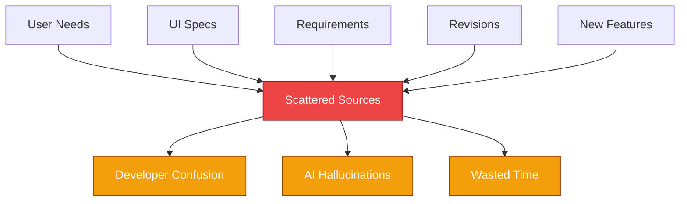
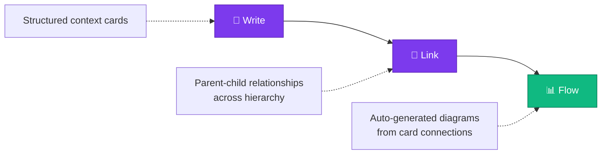
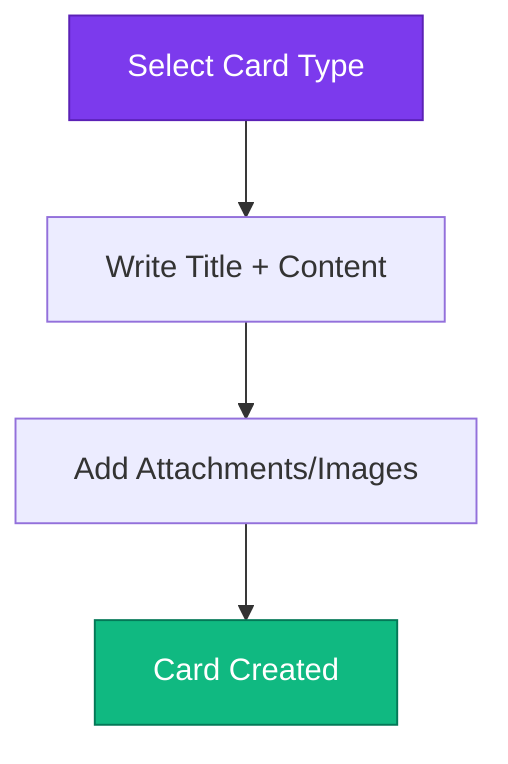
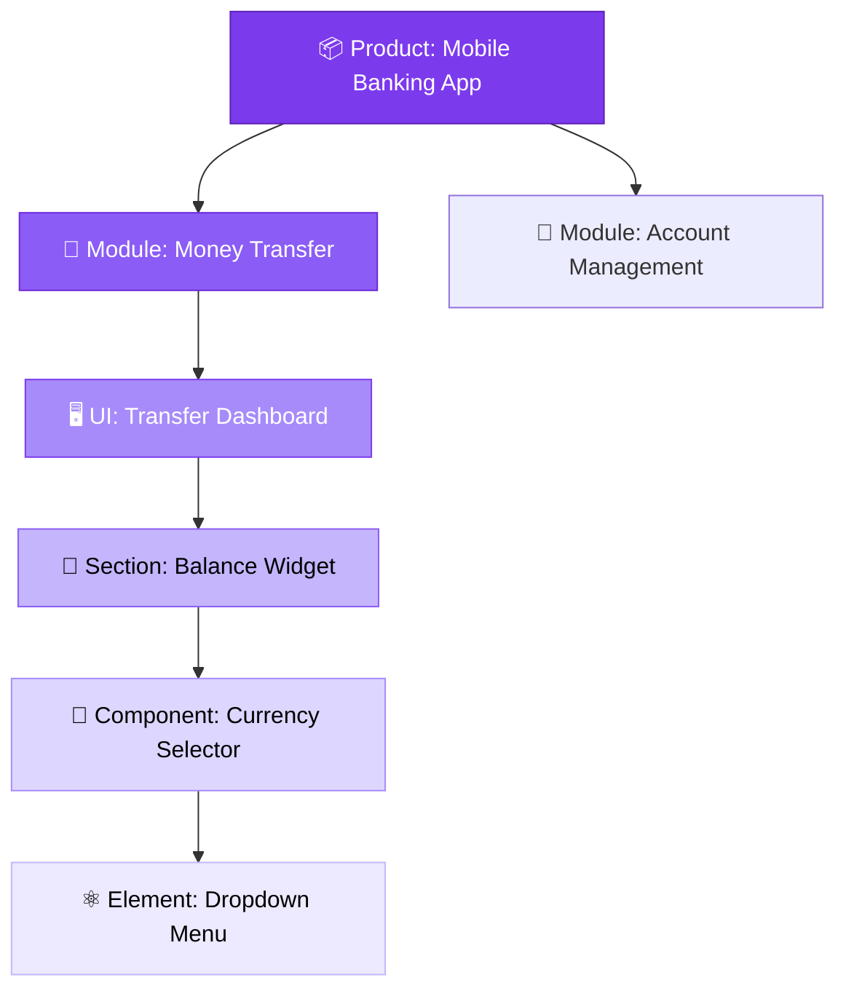
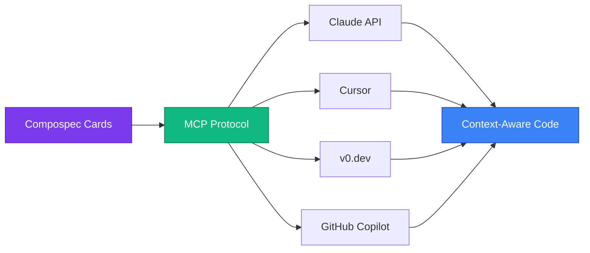

# The Compospec Methodology

**Specification intelligence for AI-native development**

> Build product specifications as structured context cards with auto-generated flow diagrams.

[](https://compospec.com)
[](https://app.compospec.com)
[](https://linkedin.com/company/compospec)

---

## The Problem: Spec Chaos

AI can't fix broken specs. If your product requirements live in scattered docs, slides, and Slack threads: **you're building prompt debt**.

Every hallucination. Every misalignment. Every "AI got it wrong" moment traces back to one thing: **unstructured context**.


**Traditional documentation:**
- 74-page Word doc → AI context window overload
- Vague requirements → 40-question clarification loop  
- Scattered sources → AI stitches wrong pieces together

**Result:** Communication breakdown between business logic and technical reality.

---

## The Solution: Structured Context Blocks

Compospec is a **specification intelligence platform** that transforms chaotic requirements into:

- **6-level hierarchy:** `Product → Module → UI → Section → Component → Element`
- **Card-based specifications:** Persistent, linked, version-controlled
- **Auto-generated flow diagrams:** Visual representation of user journeys
- **AI-ready semantic structure:** No prompt engineering required


Your specs become a **semantic intelligence layer** ready for AI agents, developers, and stakeholders.

---

## How It Works

### 1. Write → Structured Context Cards

Select a card type from the 6-level hierarchy:
```
📦 Product      (top-level business goal)
  └─ 📂 Module      (feature cluster)
      └─ 🖥️ User Interface (screen/page)
          └─ 📐 Section       (layout region)
              └─ 🧩 Component    (interactive element)
                  └─ ⚛️ Element       (atomic unit)
```

Write requirements in natural language. No learning curve.


### 2. Link → Parent-Child Relationships

Every card (except Product) links to **one parent**. This creates:

- **Dependency graph** (what depends on what)
- **Context inheritance** (child inherits parent constraints)
- **Traceability** (requirement → implementation path)


### 3. Flow → Auto-Generated Diagrams

Flow diagrams aren't drawn — they're **derived** from parent-child relationships.

When you link cards, diagrams update automatically. No manual drawing. No stale documentation.


---

## Why Developers Care

### Hierarchical Specs Match Your Mental Model

Just like HTML DOM structure or component trees:
```html
<Product>
  <Module>
    <UserInterface>
      <Section>
        <Component>
          <Element />
        </Component>
      </Section>
    </UserInterface>
  </Module>
</Product>
```

### Explicit Dependencies = No Hidden Assumptions

Parent-child links make dependencies **visible and queryable**:
```javascript
// Pseudocode example
const button = getCard("submit-button");
const dependencies = button.getAncestors();
// Returns: [Form Component, Login Section, Auth UI, User Module, Product]
```

### AI-Ready Context Blocks = No Prompt Debt

Each card is a semantic unit with:
- **Typed fields** (not unstructured prose)
- **Explicit relationships** (not implicit mentions)
- **Hierarchical context** (parent chain = full context)

Feed cards to AI agents → precise, scoped prompts. No guesswork.

---

## Why Compospec for AI-Native Pipelines

AI code generation tools (Cursor, GitHub Copilot, v0.dev) work well for isolated components but fail at system-wide consistency.

**The problem isn't AI capability. It's context persistence.**

### The Three Failure Modes

1. **Wrong Intent:** AI misinterprets vague specs
2. **Wrong Visual:** Generated code doesn't match design system  
3. **Wrong Patterns:** Output doesn't fit codebase conventions

### Compospec as Pre-AI Semantic Layer

Instead of prompting AI directly, Compospec provides structured context that AI pipelines can query:

- **Hierarchical Cards** → preserve intent cascade; parent context flows to child cards
- **Decision Subcards** → *(coming Q2 2026)* capture component behavior as queryable state machines
- **Journey Maps** → maintain multi-step workflow context across the pipeline
- **MCP Protocol Integration** → *(coming Q1 2026)* connects directly to Claude, Cursor, Figma MCP, Code Connect


**Spec.md is a file. Compospec is a schema.**

That's the difference between using AI and shipping with it.

---

## Repository Structure

This repository documents the Compospec methodology — the principles, patterns, and practices that make specification intelligence possible.
```
compospec-methodology/
├── README.md              ← You are here
├── METHODOLOGY.md         ← Deep dive into the system
├── EXAMPLES.md            ← Real-world use cases
├── COMPARISON.md          ← vs other approaches
└── assets/
    └── diagrams/          ← Mermaid source + exported PNGs
```

---

## Use Cases

- **Spec-driven development:** Start with structure, not chaos
- **AI-native pipelines:** Pre-AI semantic layer for Cursor, Copilot, v0.dev workflows
- **AI agent context:** Feed semantically rich specs to LLMs
- **Cross-team alignment:** Single source of truth for product, design, engineering
- **Legacy modernization:** Document existing systems with precision

---

## Get Started

**📖 Learn the methodology:** [Read METHODOLOGY.md →](./METHODOLOGY.md)

**💻 Try Compospec Beta:** [app.compospec.com](https://app.compospec.com)

**🌐 Website:** [compospec.com](https://compospec.com)

**📧 Questions?** [info@compospec.com](mailto:info@compospec.com)

---

## What's Next

- **SS Annotation** *(Q1 2026)*: Screenshot-to-card workflow with browser-native Screen Capture API
- **MCP Integration** *(Q1 2026)*: Direct protocol connection to Claude, Cursor, Figma, Code Connect
- **Decision Subcards** *(Q2 2026)*: State/event/transition modeling for component behavior
- **Journey Tags** *(Q2 2026)*: Filter flows by user task (purchase, login, cancel) across the system

---

**Built with conviction in London 🇬🇧**

*Compospec is a product of [Tabulas Design Ltd](https://tabulasdesign.co.uk)*
